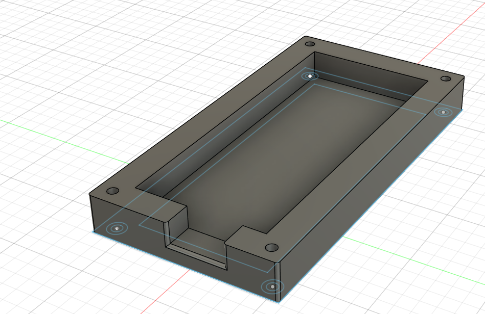

# hackpad
this is a hackpad that i made to be more productive and to serve as a media player :)

I made this to learn about "professional" hardware and prototype making 

Bill of materials:
Item                    price (zł and USD)          link        count

    1. Seeed Xiao RP2040         22,90zł 6,25$    https://botland.com.pl/plytki-z-mikrokontrolerem-rp2040/19980-seeed-xiao-rp2040-arm-cortex-m0-seeedstudio-102010428-5904422379834.html      1

    2. EC11 Rotary Encoder       4,50zł  1,23$    https://allegro.pl/oferta/enkoder-encoder-ec-11-20-obrotow-z-przyciskiem-8538262001   1

    3. SK6812 Mini LED           7,38zł  2,01$    https://pl.aliexpress.com/item/32623583544.html?spm=a2g0o.productlist.main.2.52dd6c6c6pKWXR&algo_pvid=750bc9e1-a8e1-4158-a7e4-195d24a042e0&algo_exp_id=750bc9e1-a8e1-4158-a7e4-195d24a042e0-1&pdp_ext_f=%7B"order"%3A"101"%2C"eval"%3A"1"%2C"fromPage"%3A"search"%7D&pdp_npi=6%40dis%21PLN%217.38%213.71%21%21%211.97%210.99%21%40211b80d117645093018255178efa40%2112000038353355755%21sea%21PL%210%21ABX%211%210%21n_tag%3A-29910%3Bd%3Ade3fb974%3Bm03_new_user%3A-29895%3BpisId%3A5000000187468747&curPageLogUid=GX2PPtmkW6NT&utparam-url=scene%3Asearch%7Cquery_from%3A%7Cx_object_id%3A32623583544%7C_p_origin_prod%3A       7

    4. MX-style Switches         58,64zł 16$      https://www.amazon.com/Cherry-MX-RGB-Mechanical-Keyboard/dp/B0F4Y8N29V?th=1   7

    5. PCB                       ~73,30zł~20$     pcbway.com     1

    6. 3d Print                  ill ask my school they have 3 3d printers but idk if they will accept (prob yes they are very nice)

# TOTAL 166.72zł 45.5$

# Schematics 

It took me like 3 tries

# Pcb

Aint the prettiest but it took me like 4 tries

# 3d Model

Same with the pcb isnt the prettiest but it took me in total ~15 hours (Everything took ~15 hours)
