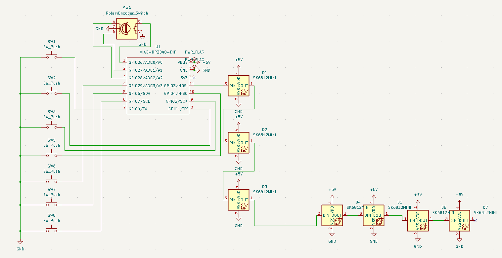
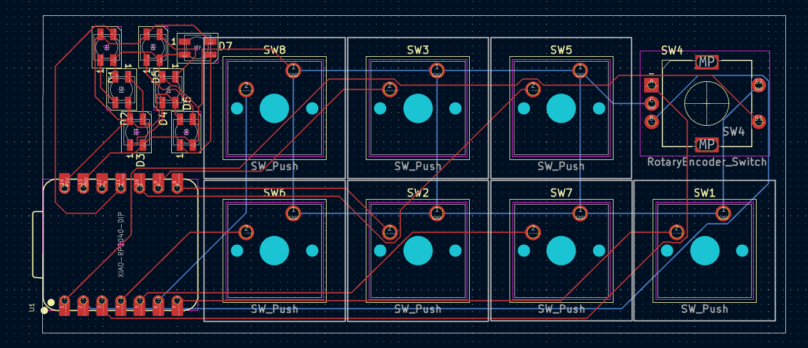
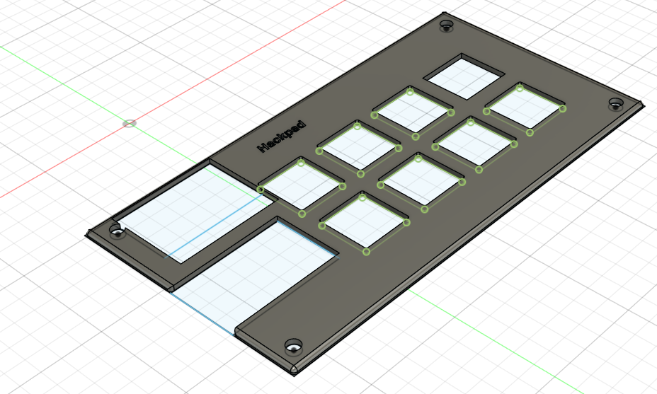
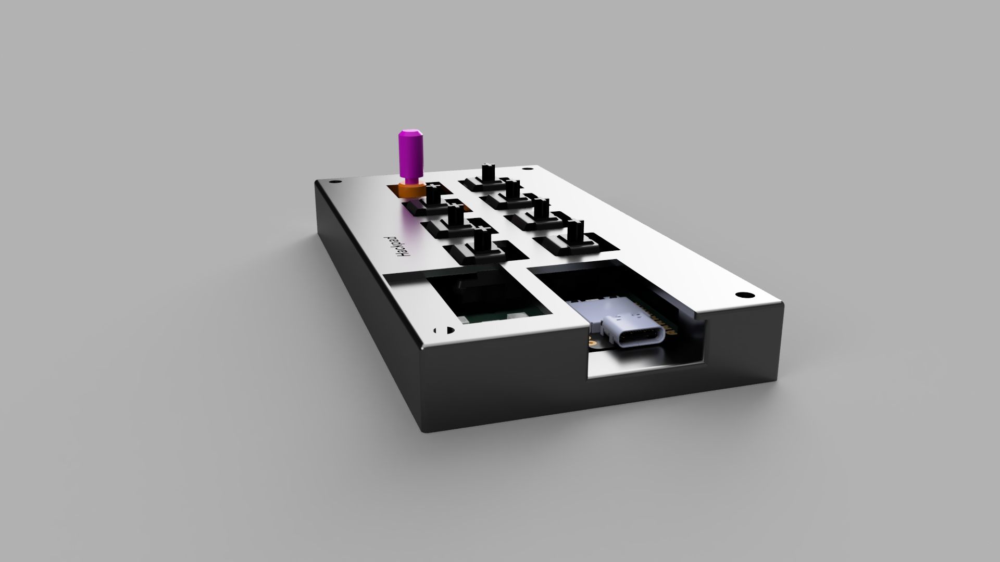
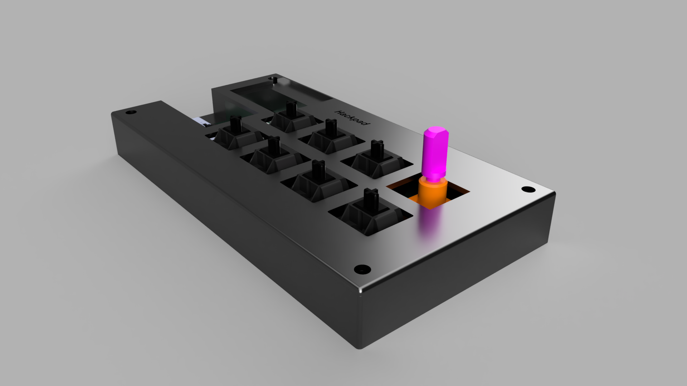
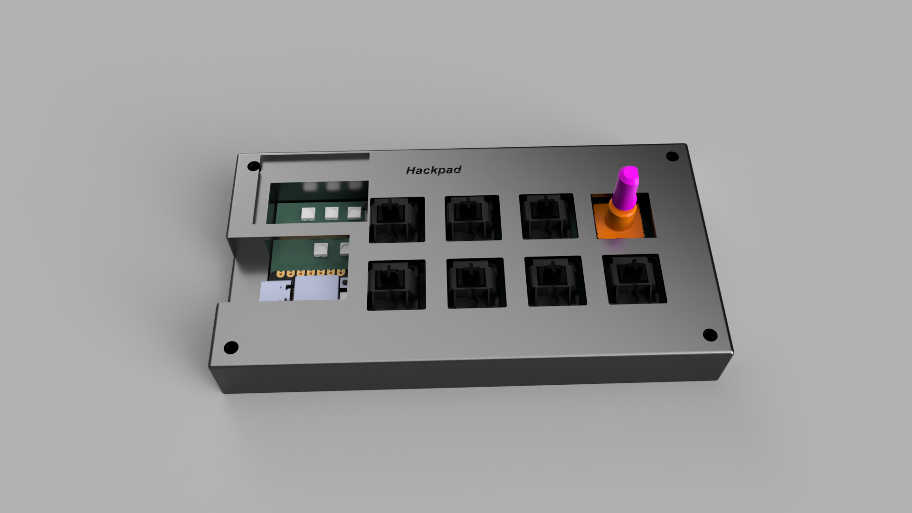

# hackpad
this is a hackpad that i made to be more productive and to serve as a media player :)

I made this to learn about "professional" hardware and prototype making 

# [Bill Of Materials](/bom.csv)

# Schematics 

It took me like 3 tries

# Pcb

Aint the prettiest but it took me like 4 tries

# 3d Model

Same with the pcb isnt the prettiest but it took me in total ~15 hours (Everything took ~15 hours)

# Final Render 

please forgive the rotary encoder being pink and orange i could not for the life of me find the step file for it

# Early Prototypes

